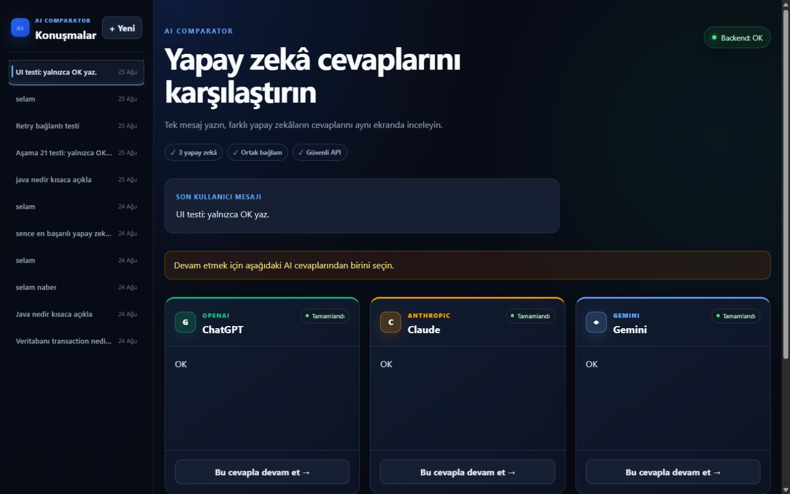
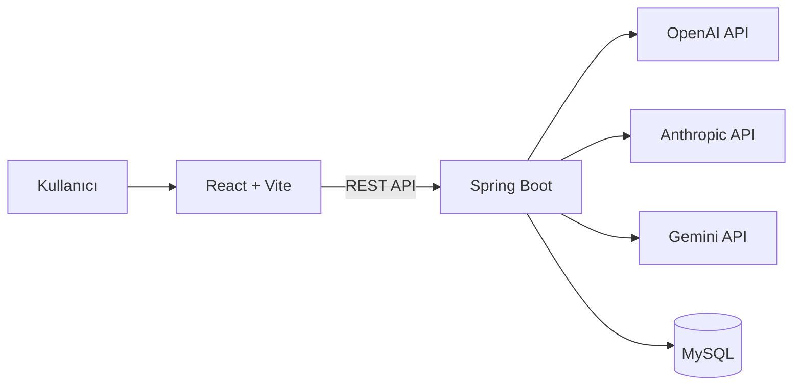

# AI Comparator

Tek bir kullanıcı mesajını OpenAI, Anthropic Claude ve Google Gemini servislerine aynı anda gönderen; cevapları karşılaştırmalı panellerde sunan full-stack web uygulaması.

Kullanıcı beğendiği AI cevabını aktif dal olarak seçebilir. Sonraki mesaj, yalnızca seçilen konuşma geçmişi bağlam alınarak yeniden üç sağlayıcıya paralel biçimde gönderilir.



## Özellikler

- Tek mesajla OpenAI, Claude ve Gemini karşılaştırması
- Üç AI isteğinin paralel çalıştırılması
- Server-Sent Events ile parça parça (streaming) cevap gösterimi
- Markdown ve kod bloklarının render edilmesi
- Sağlayıcı bazında loading, hata ve tekrar deneme durumları
- Bir sağlayıcı hata verdiğinde diğer cevapların korunması
- Kullanıcının istediği cevaptan konuşmaya devam edebilmesi
- Parent-child mesaj modeliyle konuşma dallanması
- Yalnızca aktif dalın AI context'ine eklenmesi
- Konuşmaların ve mesajların MySQL'de saklanması
- Geçmiş konuşmaları listeleme ve yeniden açma
- Responsive masaüstü, tablet ve mobil arayüz
- API anahtarlarının yalnızca backend ortamında tutulması
- Backend ve frontend timeout koruması

## Mimari



Frontend hiçbir AI servisine doğrudan bağlanmaz. API anahtarları Spring Boot backend'de environment variable olarak okunur.

### Konuşma dallanması

Her mesaj, `parent_message_id` alanıyla kendisinden önceki seçili mesaja bağlanır:

```text
USER: Java nedir?
├── OPENAI cevabı       ← kullanıcı bunu seçti
│   └── USER: Örnek verir misin?
│       ├── OPENAI cevabı
│       ├── ANTHROPIC cevabı
│       └── GEMINI cevabı
├── ANTHROPIC cevabı
└── GEMINI cevabı
```

Yeni isteğin context'i oluşturulurken kullanılmayan alternatif cevaplar dahil edilmez.

## Teknolojiler

| Katman | Teknolojiler |
| --- | --- |
| Frontend | React 19, JavaScript, Vite 8, CSS |
| Backend | Java 21, Spring Boot 4, Spring Web MVC |
| Veri erişimi | Spring Data JPA, Hibernate |
| Veritabanı | MySQL 8.4, Flyway (şema migrasyonları) |
| AI servisleri | OpenAI, Anthropic Claude, Google Gemini |
| Eş zamanlılık | `CompletableFuture`, Java virtual threads |
| Test | JUnit, Spring Boot Test, AssertJ, Mockito |
| Versiyon kontrolü | Git, GitHub |

## Proje yapısı

```text
ai-comparator/
├── backend/
│   └── src/main/java/com/example/aicomparator/
│       ├── ai/          # AI provider implementasyonları
│       ├── config/      # CORS ve executor ayarları
│       ├── controller/  # REST endpoint'leri
│       ├── dto/         # API request/response modelleri
│       ├── entity/      # JPA entity'leri
│       ├── repository/  # Spring Data repository'leri
│       └── service/     # İş kuralları ve context yönetimi
├── frontend/
│   └── src/
│       ├── components/  # AI paneli, mesaj alanı ve sidebar
│       ├── services/    # Backend API istemcisi
│       ├── App.jsx
│       └── App.css
└── docs/screenshots/    # README görselleri
```

## Gereksinimler

- Java 21
- Node.js 24 veya uyumlu güncel LTS sürümü
- npm 11+
- MySQL 8+
- Git

Backend Maven Wrapper içerdiği için Maven'ın sistem genelinde kurulu olması zorunlu değildir.

## Kurulum

### 1. Repoyu klonlayın

```powershell
git clone https://github.com/alpasrinc/ai-comparator.git
cd ai-comparator
```

### 2. MySQL veritabanını hazırlayın

MySQL terminaline root kullanıcısıyla bağlanın:

```powershell
mysql -u root -p
```

Ardından aşağıdaki SQL komutlarını çalıştırın. Örnek parolayı güçlü bir parolayla değiştirin.

```sql
CREATE DATABASE ai_comparator
    CHARACTER SET utf8mb4
    COLLATE utf8mb4_0900_ai_ci;

CREATE USER 'ai_comparator_app'@'localhost'
    IDENTIFIED BY 'GUCLU_BIR_PAROLA';

GRANT ALL PRIVILEGES
    ON ai_comparator.*
    TO 'ai_comparator_app'@'localhost';

FLUSH PRIVILEGES;
```

### 3. Environment değişkenlerini ayarlayın

Gerekli değişkenler:

| Değişken | Zorunlu | Açıklama |
| --- | --- | --- |
| `AI_COMPARATOR_DB_PASSWORD` | Evet | MySQL uygulama kullanıcısının parolası |
| `OPENAI_API_KEY` | Evet | OpenAI API anahtarı |
| `ANTHROPIC_API_KEY` | Evet | Anthropic API anahtarı |
| `GEMINI_API_KEY` | Evet | Google Gemini API anahtarı |
| `AI_REQUEST_TIMEOUT_SECONDS` | Hayır | AI çağrısı timeout süresi; varsayılan `30` |
| `OPENAI_MODEL` | Hayır | OpenAI model override değeri |
| `ANTHROPIC_MODEL` | Hayır | Claude model override değeri |
| `ANTHROPIC_MAX_OUTPUT_TOKENS` | Hayır | Claude çıktı token sınırı |
| `GEMINI_MODEL` | Hayır | Gemini model override değeri |
| `GEMINI_MAX_OUTPUT_TOKENS` | Hayır | Gemini çıktı token sınırı |

PowerShell oturumu için:

```powershell
$env:AI_COMPARATOR_DB_PASSWORD="GUCLU_BIR_PAROLA"
$env:OPENAI_API_KEY="OPENAI_API_KEY"
$env:ANTHROPIC_API_KEY="ANTHROPIC_API_KEY"
$env:GEMINI_API_KEY="GEMINI_API_KEY"
```

> API anahtarlarını kaynak koda, frontend dosyalarına veya Git geçmişine eklemeyin.

### 4. Backend'i çalıştırın

Windows:

```powershell
cd backend
.\mvnw.cmd spring-boot:run
```

macOS/Linux:

```bash
cd backend
./mvnw spring-boot:run
```

Backend varsayılan olarak `http://localhost:8080` adresinde çalışır.

Health kontrolü:

```powershell
Invoke-RestMethod http://localhost:8080/api/health
```

Beklenen cevap:

```json
{
  "status": "OK"
}
```

### 5. Frontend'i çalıştırın

Yeni bir terminal açın:

```powershell
cd frontend
npm install
npm run dev
```

Uygulama varsayılan olarak `http://localhost:5173` adresinde açılır.

Farklı bir backend adresi kullanılacaksa frontend ortamına `VITE_API_BASE_URL` eklenebilir.

### 6. (Alternatif) Docker Compose ile çalıştırın

MySQL, backend ve frontend'i tek komutla ayağa kaldırmak için:

```powershell
$env:AI_COMPARATOR_DB_PASSWORD="GUCLU_BIR_PAROLA"
$env:OPENAI_API_KEY="OPENAI_API_KEY"
$env:ANTHROPIC_API_KEY="ANTHROPIC_API_KEY"
$env:GEMINI_API_KEY="GEMINI_API_KEY"

docker compose up --build
```

Frontend `http://localhost:5173`, backend `http://localhost:8080` adresinde çalışır.

## API özeti

| Metot | Endpoint | Açıklama |
| --- | --- | --- |
| `GET` | `/api/health` | Backend sağlık kontrolü |
| `POST` | `/api/chat/compare` | Mesajı üç AI sağlayıcısına gönderir (tüm cevaplar tamamlandığında döner) |
| `POST` | `/api/chat/compare/stream` | Aynı işlemi Server-Sent Events ile parça parça (streaming) döner |
| `POST` | `/api/chat/retry` | Başarısız bir sağlayıcıyı yeniden dener |
| `POST` | `/api/chat/openai` | Yalnızca OpenAI çağrısı yapar |
| `POST` | `/api/chat/anthropic` | Yalnızca Anthropic çağrısı yapar |
| `POST` | `/api/chat/gemini` | Yalnızca Gemini çağrısı yapar |
| `GET` | `/api/conversations` | Konuşmaları listeler |
| `GET` | `/api/conversations/{id}` | Konuşma mesajlarını getirir |
| `POST` | `/api/conversations/{id}/active-message` | Aktif konuşma dalını seçer |

### Karşılaştırma örneği

İstek:

```http
POST /api/chat/compare
Content-Type: application/json
```

```json
{
  "conversationId": null,
  "message": "Spring Boot nedir?"
}
```

Başarılı cevap yapısı:

```json
{
  "conversationId": 1,
  "userMessageId": 10,
  "responses": [
    {
      "messageId": 11,
      "provider": "OPENAI",
      "content": "...",
      "error": null
    }
  ]
}
```

Bir sağlayıcı hata verirse diğer cevaplar korunur ve ilgili response içinde `error` alanı doldurulur.

### Streaming örneği

`POST /api/chat/compare/stream` aynı gövdeyi kabul eder ve `text/event-stream` formatında olay yayınlar:

| Olay | İçerik |
| --- | --- |
| `start` | `{ conversationId, userMessageId }` |
| `token` | `{ provider, delta }` — sağlayıcıdan gelen metin parçası |
| `done` | `{ provider, messageId, content }` — sağlayıcı tamamlandı |
| `error` | `{ provider, message }` — sağlayıcı hata verdi veya zaman aşımına uğradı |

Üç sağlayıcının tamamı bitince (başarı/hata fark etmeksizin) bağlantı kapanır.

## Test ve kalite kontrolleri

Backend testleri:

```powershell
cd backend
.\mvnw.cmd test
```

Frontend kontrolleri:

```powershell
cd frontend
npm run lint
npm run build
```

Mevcut backend test paketi şunları kapsar:

- Spring context başlangıcı
- Repository ve MySQL entegrasyonu
- Konuşma kaydetme ve dallanma
- Aktif context oluşturma
- Sağlayıcı hata izolasyonu
- Timeout davranışı
- Başarısız cevabı yeniden deneme ve kaydetme

## Güvenlik

- API anahtarları frontend'e gönderilmez.
- Secret değerleri source code içinde tutulmaz.
- `.env` dosyaları Git tarafından yok sayılır.
- AI çağrıları yalnızca backend üzerinden yapılır.
- Sağlayıcı exception ayrıntıları doğrudan kullanıcıya açılmaz.
- İsteklerde backend ve frontend timeout koruması bulunur.

## Gelecek geliştirmeler

- Syntax highlighting (kod blokları şu an düz monospace render ediliyor)
- Model seçimi
- Token kullanımı ve gecikme ölçümü
- Konuşma arama, yeniden adlandırma ve silme
- Kullanıcı hesabı ve authentication
- Docker ve Docker Compose

## Proje durumu

İlk MVP tamamlanmıştır. Uygulama üç AI servisinden cevap alabilir, cevapları karşılaştırabilir, seçilen cevap üzerinden dallanarak devam edebilir ve konuşma geçmişini MySQL'de kalıcı olarak saklayabilir.

Bu proje bir staj çalışması kapsamında full-stack geliştirme, REST API tasarımı, veritabanı modelleme ve yapay zekâ servis entegrasyonlarını öğrenmek amacıyla geliştirilmiştir.
